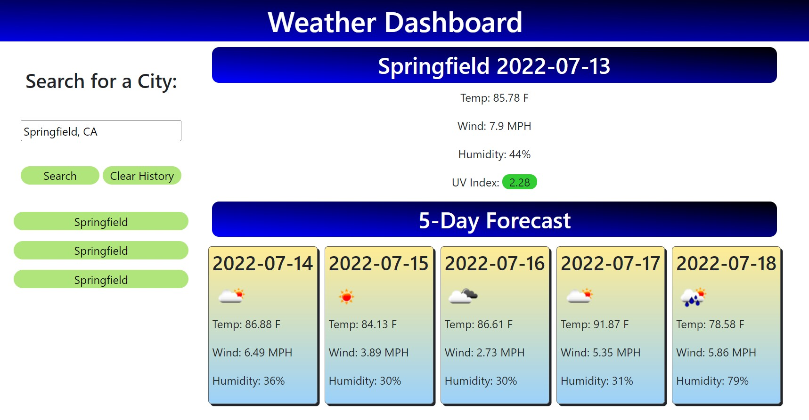
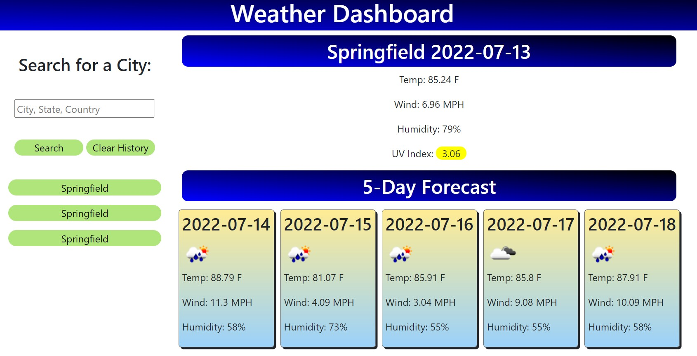

# Weather Dashboard
[](https://opensource.org/licenses/MIT)   

## Description  

An application that will utilize the One Call API to display weather information for the searched city.

**User Story**
```
AS A traveler
I WANT to see the weather outlook for multiple cities
SO THAT I can plan a trip accordingly
```

**Acceptance Criteria**
```
GIVEN a weather dashboard with form inputs
WHEN I search for a city
THEN I am presented with current and future conditions for that city and that city is added to the search history
WHEN I view current weather conditions for that city
THEN I am presented with the city name, the date, an icon representation of weather conditions, the temperature, the humidity, the wind speed, and the UV index
WHEN I view the UV index
THEN I am presented with a color that indicates whether the conditions are favorable, moderate, or severe
WHEN I view future weather conditions for that city
THEN I am presented with a 5-day forecast that displays the date, an icon representation of weather conditions, the temperature, the wind speed, and the humidity
WHEN I click on a city in the search history
THEN I am again presented with current and future conditions for that city
```

## Table of Contents  
1. [Description](#description)
2. [Deployment](#deployment)
3. [Optimizations](#optimizations)
4. [Contributing](#contributing)  
5. [Questions](#questions)  
6. [License](#license)

## Deployment

[Deployed Website](https://mmelan000.github.io/Weather-Dashboard-powered-by-API/)


Springfield vs. Springfield





## Optimizations

- Supports multiple search types:
    - City Name (Global)
    - City and State (US Only)
    - City and Country (Global)
    - City, State, and Country (Global)
    - Zip Code (US Only)
- Mobile friendly.
- History Tab for cycling easily through past searches.
- Color coded UV index using intuitive colors to represent severity.
- Buttons store city ID to allow for callbacks to specific city searched in the event of multiple cities with the same name.

## Contributing  

Follow best practices for naming conventions, indentation, quality comments, etc.  

## Questions  

If you have any questions, please reach out to me either on Github or by Email.
  - **Github:** [mmelan000](https://github.com/mmelan000)
  - **Email:** [m.melanson000@gmail.com](mailto:m.melanson000@gmail.com)

## License  

- [MIT](https://opensource.org/licenses/MIT)